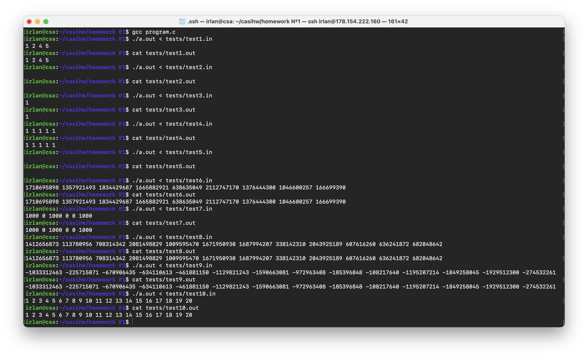

# Отчет

## Задание:
*Вариант №5. Сформировать массив B, состоящий из элементов массива А, значение которых не совпадает с введённым числом X.* 

## Код на языке С:
[program.c](https://github.com/1rlan/csaihw/blob/master/homework%20%E2%84%961/program.c)  - код программ\
Вводится число size - количество элементов в массиве, далее вводится. число x - элемент, который игорируется, далее вводятся size чисел. 

## Код на языке Асемблера:
[program.s](https://github.com/1rlan/csaihw/blob/master/homework%20%E2%84%961/program.s) - код без комментариев и ручного редактирования.\
[clean.s](https://github.com/1rlan/csaihw/blob/master/homework%20%E2%84%961/clean.s) - код  ```program.c```  c комментариями и оптимизацией.

## Флаги 
Дизасемблирование осуществлялось с использованием флагов:
```terminal
gcc -masm=intel \
    -fno-asynchronous-unwind-tables \
    -fno-jump-tables \
    -fno-stack-protector \
    -fno-exceptions \
    ./program.c \
    -S -o ./program.s
```


## Тесты 
[tests](https://github.com/1rlan/csaihw/tree/master/homework%20%E2%84%961/tests) - папка с тестами\
Для проверки корректности программы использовались тесты, проверяющие крайние значения (массивы единичной и нулевой длины), массивы четной и нечетной длины, массивы, в которых необходимо удалить каждый или не удалять вовсе, массивы с болшими положительными и отрицательными числами.

Проведем первые тесты на "чистом" ассемблерном файле и убедимся, что все работает:


# Чистка и оптимизация файла

## Чистка 
Удалим инфорацию о Си файла:
```assembly
        .file   "program.c
```

Уберем, как сказал мой товарищ, "копеечные оптимизации", удалив все:
```assembly
        .size main, .-main    # и для других методов тоже
        mov eax, 0
        nop
```

Уберем все строки:
```assembly
        endbr64
        cdqe
```

Удалим экспорт символов методов:
```assembly        
        .type input, @function
        .type  input, @function
        .type make_new_array, @function
        .type output, @function
        .type main, @function
```

Удалим информацию о дизасемблировании:
```assembly
        .ident  "GCC: (Ubuntu 11.2.0-19ubuntu1) 11.2.0"
        .section        .note.GNU-stack,"",@**progbits**
        .section        .note.gnu.property,"a"
        .align 8
        .long   1**f** - 0**f**
        .long   4**f** - 1**f**
        .long   5
0:
        .string "GNU"
1:
        .align 8
        .long   0xc0000002
        .long   3**f** - 2**f**
2:
        .long   0x3
3:
        .align 8
4:
```


## Замены
Будем класть значения в регистр rsi напрямую. Рассмотрим, например, вызов scanf, в нем можно заменить строки
```
        lea rax, -92[rbp]
        mov rsi, rax

		# Заменяем на:

		mov rsi, -92[rbp]
```


Перепишем огромный и непонятный блок создания массивов new_array и old_array (161-206 и 214-260 строки ) череp malloc:
Выделяем память:
```
		mov rax, -92[rbp]
		shl rax, 3 
		mov rdi, rax 
		call malloc@PLT 
		mov QWORD PTR -64[rbp], rax 


		mov DWORD PTR -68[rbp], eax
		shl rax, 3 
		mov rdi, rax 
		call malloc@PLT #
		mov QWORD PTR -88[rbp], rax
```
Чистим память:
```
		mov rdi, QWORD PTR -64[rbp] # rdi = old_array
		call free@PLT
```

