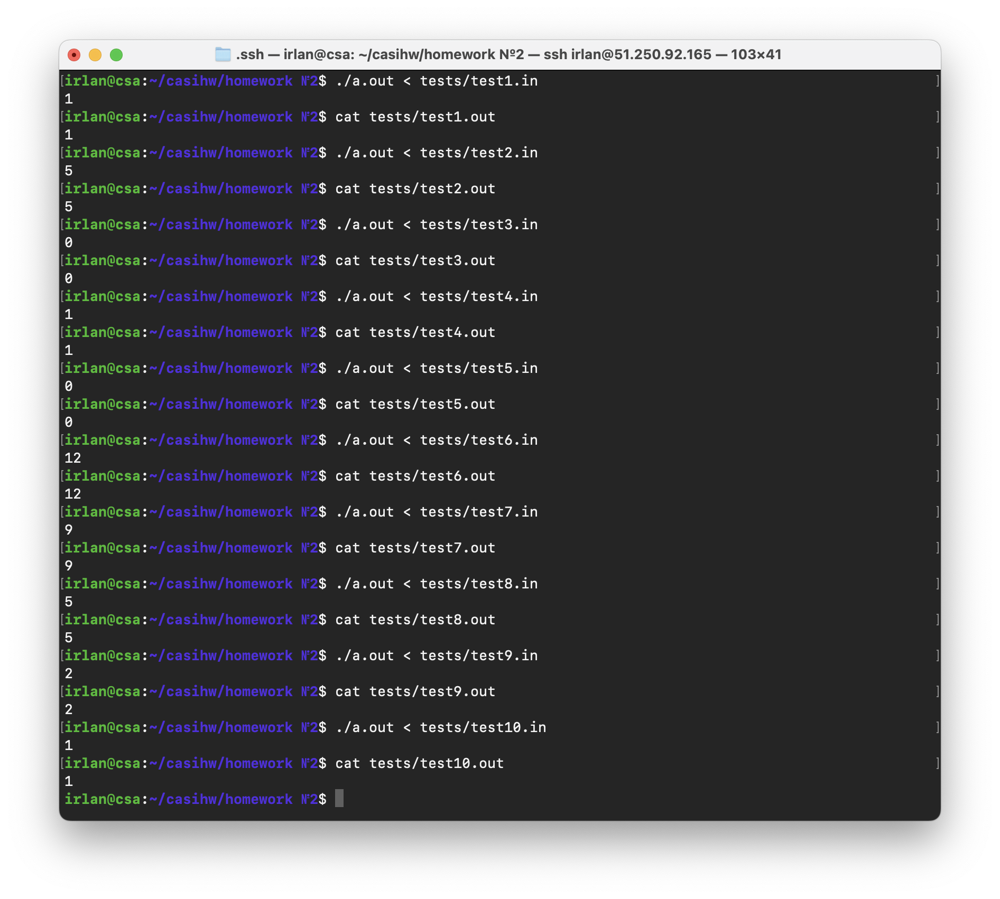

# Отчет

## Задание:
*Вариант 26. Разработать программу, которая определяет количество целых чисел в ASCII-строке. числа состоят из цифр от 0 до 9. Разделителями являются все другие символы.* 

## Код на языке С:
[program.c](https://github.com/1rlan/csaihw/blob/master/homework%20%E2%84%962/program.c) - код изначальной программы\
Вводится строка. Признак окончания строки - ее перевод (нажатый enter).

## Код на языке Асемблера:
[program.s](https://github.com/1rlan/csaihw/blob/master/homework%20%E2%84%962/program.s) - код без комментариев и ручного редактирования. *192 строки*\
[clean.s](https://github.com/1rlan/csaihw/blob/master/homework%20%E2%84%962/clean.s) - код  ```program.c```  c комментариями и оптимизацией.

## Флаги 
Дизасемблирование осуществлялось с использованием флагов:
```terminal
gcc -masm=intel \
    -fno-asynchronous-unwind-tables \
    -fno-jump-tables \
    -fno-stack-protector \
    -fno-exceptions \
    ./program.c \
    -S -o ./program.s
```

## Тесты 
[tests](https://github.com/1rlan/csaihw/tree/master/homework%20%E2%84%962/tests) - папка с тестами\
Для проверки корректности программы использовались тесты, проверяющие крайние значения (строки нулевой и единичной длины), строки с различными расположением цифр в начале и конце строки, строки без букв или без цифр и далее по списку...

Проведем первые тесты на "чистом" ассемблерном файле и убедимся, что все работает:

# Чистка и оптимизация файла

## Чистка 
Удалим инфорацию о Си файла:
```assembly
	 .file   "program.c
```

Уберем "копеечные оптимизации", удалив строки:
```assembly
	.size main, .-main 
	.size isDigit, .-isDigit
	.size isNotDigit, .-isNotDigit
	.size input, .-input
	.size count, .-count
	.size main, .-main
```

Уберем все строки:
```assembly
	mov eax, 0
	endbr64
	cdqe
```

Удалим экспорт символов методов:
```assembly        
	.type isDigit, @function
	.type isNotDigit, @function
	.type input, @function
	.type count, @function
	.type main, @function
```

Удалим информацию о дизасемблировании:
```assembly
	.ident "GCC: (Ubuntu 11.2.0-19ubuntu1) 11.2.0"
	.section .note.GNU-stack,"",@progbits
	.section .note.gnu.property,"a"
	.align 8
	.long 1f - 0f
	.long 4f - 1f
	.long 5
0:
	.string "GNU"
1:
	.align 8
	.long 0xc0000002
	.long 3f - 2f
2:
	.long 0x3
3:
	.align 8
4:
```


## Замены
Будем класть значения в регистр rdi напрямую. Рассмотрим, например, вызов printf, в нем можно заменить строки
```assembly
	lea rax, .LC0[rip]
	mov rdi, rax

	# Заменяем на:

	mov rdi, .LC0[rip]	
```
Поступим так же со связкой rax - rdi:
```assembly
	mov rax, QWORD PTR -8[rbp]
	mov rdi, rax
		
	# Заменяем на:
		
	mov rdi, QWORD PTR -8[rbp]
```

## Оптимизация
Выполним замены для оптимизации работы программы, будем использовать регистры:
```assembly

	QWORD PTR -24[rbp] -> rbx      # Основная строка
	DWORD PTR -8[rbp] -> r12d      # Счетчик цикла (i)
	DWORD PTR -4[rbp] -> r13d      # Переменные counter и size	
	DWORD PTR -28[rbp] -> r14d     # Переменная lenght
```