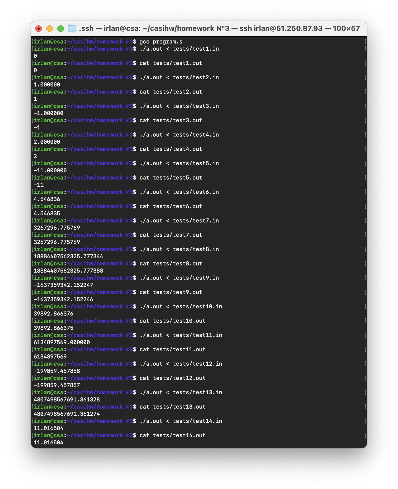

## Задание:
*Вариант №19. Разработать программу вычисления корня кубического из заданного числа n согласно быстро сходящемуся итерационному алгоритму определения корня k-ой степени с точностью не хуже 0,05%.* 

## Код на языке С:
[Битая ссылка](https://github.com/1rlan/csaihw/blob/mhomework%20%E2%84%961/program.c)  - код программ\
Вводится число n. Программа вычисляет кубический корень этого числа с помощью быстросходящегося алгоритм нахождения корня  n-ой степени. Алгоритм - [wiki](https://ru.m.wikipedia.org/wiki/%D0%90%D0%BB%D0%B3%D0%BE%D1%80%D0%B8%D1%82%D0%BC_%D0%BD%D0%B0%D1%85%D0%BE%D0%B6%D0%B4%D0%B5%D0%BD%D0%B8%D1%8F_%D0%BA%D0%BE%D1%80%D0%BD%D1%8F_n-%D0%BD%D0%BE%D0%B9_%D1%81%D1%82%D0%B5%D0%BF%D0%B5%D0%BD%D0%B8).

## Код на языке Асемблера:
[Битая ссылка]() - код без комментариев и ручного редактирования.\
[Битая ссылка]() - код  ```program.c```  c комментариями и оптимизацией.

## Флаги 
Дизасемблирование осуществлялось с использованием флагов:
```terminal
gcc -masm=intel \
    -fno-asynchronous-unwind-tables \
    -fno-jump-tables \
    -fno-stack-protector \
    -fno-exceptions \
    ./program.c \
    -S -o ./program.s
```

## Тесты 
[Битая ссылка](://github.com/1rlan/csaihw/tree/master/homework%20%E2%84%961/tests) - папка с тестами\
Для проверки корректности программы использовались тесты, проверяющие крайние значения - единицы и нули, различные целые и нецелые числа, отрицательные числа. Программа должно удовлетворять значению точности не менее 0.0005.

Проведем первые тесты на "чистом" ассемблерном файле и убедимся, что все работает:

Все тесты работают корректно, значения попадают в заданную погрешность.


# Чистка и оптимизация файла

## Чистка 
Удалим инфорацию о Си файла:
```assembly
	.file   "program.c
```

Уберем команду:
```assembly
	endbr64
```

Уберем все строки:
```assembly
	.size main, .-main 
	.size isDigit, .-isDigit
	.size isNotDigit, .-isNotDigit
	.size input, .-input
	.size count, .-count
	.size main, .-main
```

Удалим экспорт символов методов:
```assembly
	.size root, .-root
	.size nextStep, .-nextStep
	.type main, @function
```

Удалим информацию о дизасемблировании:
```assembly
	.ident "GCC: (Ubuntu 11.2.0-19ubuntu1) 11.2.0"
	.section .note.GNU-stack,"",@progbits
	.section .note.gnu.property,"a"
	.align 8
	.long 1f - 0f
	.long 4f - 1f
	.long 5
0:
	.string "GNU"
1:
	.align 8
	.long 0xc0000002
	.long 3f - 2f
2:
	.long 0x3
3:
	.align 8
4:
```

