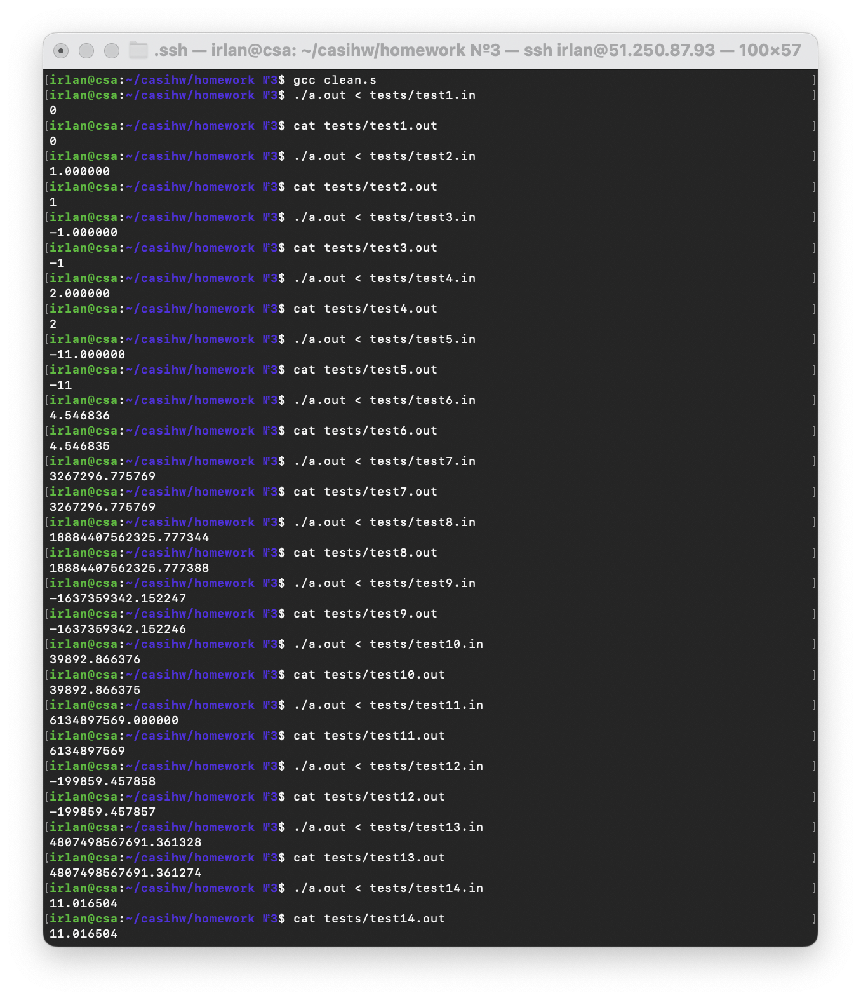
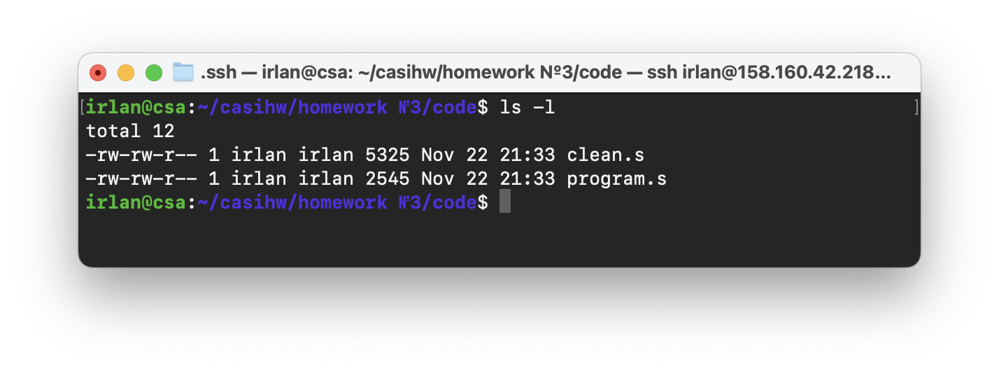

## Задание:
*Вариант №19. Разработать программу вычисления корня кубического из заданного числа n согласно быстро сходящемуся итерационному алгоритму определения корня k-ой степени с точностью не хуже 0,05%.* 

## Код на языке С:
[program.c](https://github.com/1rlan/ComputerSystemsIndividualHW/blob/master/homework%20%E2%84%963/program.c)  - код программы\
Вводится число n. Программа вычисляет кубический корень этого числа с помощью быстросходящегося алгоритм нахождения корня  n-ой степени. Алгоритм - [wiki](https://ru.m.wikipedia.org/wiki/%D0%90%D0%BB%D0%B3%D0%BE%D1%80%D0%B8%D1%82%D0%BC_%D0%BD%D0%B0%D1%85%D0%BE%D0%B6%D0%B4%D0%B5%D0%BD%D0%B8%D1%8F_%D0%BA%D0%BE%D1%80%D0%BD%D1%8F_n-%D0%BD%D0%BE%D0%B9_%D1%81%D1%82%D0%B5%D0%BF%D0%B5%D0%BD%D0%B8).

## Код на языке Асемблера:
[program.s](https://github.com/1rlan/ComputerSystemsIndividualHW/blob/master/homework%20%E2%84%963/program.s) - код без комментариев и ручного редактирования.\
[clean.s](https://github.com/1rlan/ComputerSystemsIndividualHW/blob/master/homework%20%E2%84%963/clean.s) - код  ```program.s```  c комментариями и оптимизацией.

## Флаги 
Дизасемблирование осуществлялось с использованием флагов:
```terminal
gcc -masm=intel \
    -fno-asynchronous-unwind-tables \
    -fno-jump-tables \
    -fno-stack-protector \
    -fno-exceptions \
    ./program.c \
    -S -o ./program.s
```

## Тесты 
[tests](https://github.com/1rlan/ComputerSystemsIndividualHW/tree/master/homework%20%E2%84%963/tests) - папка с тестами\
Для проверки корректности программы использовались тесты, проверяющие крайние значения - единицы и нули, различные целые и нецелые числа, отрицательные числа. Программа должно удовлетворять значению точности не менее 0.0005. Все ручные тесты проводились с помощью вычислений корня на сайте [wolfram](https://www.wolframalpha.com/).

Проведем первые тесты на "чистом" ассемблерном файле и убедимся, что все работает:

Все тесты работают корректно, значения попадают в заданную погрешность.


# Чистка и оптимизация файла

## Чистка 
Удалим инфорацию о Си файла:
```assembly
	.file   "program.c
```

Уберем команды:
```assembly
	endbr64
	mov eax, 0
```

Уберем все строки:
```assembly
	.size root, .-root
	.size nextStep, .-nextStep
	.size main, .-main
```

Удалим экспорт символов методов:
```assembly
	.type nextStep, @function
	.type root, @function
	.type main, @function
```

Удалим информацию о дизасемблировании:
```assembly
	.ident "GCC: (Ubuntu 11.2.0-19ubuntu1) 11.2.0"
	.section .note.GNU-stack,"",@progbits
	.section .note.gnu.property,"a"
	.align 8
	.long 1f - 0f
	.long 4f - 1f
	.long 5
0:
	.string "GNU"
1:
	.align 8
	.long 0xc0000002
	.long 3f - 2f
2:
	.long 0x3
3:
	.align 8
4:
```


## Замены
Будем класть значения в регистры напрямую:
```assembly
	mov rax, QWORD PTR -8[rbp]
	mov rdi, rax
		
	# Заменяем на:
		
	mov rdi, QWORD PTR -8[rbp]
```

Заметим, что nextStep не создает внутри себя переменных, следовательно можно обойтись без "нулевого" выделения памяти, удалив строки:
```assembly
	push rbp 
	mov rbp, rsp
	...	
	pop rbp
```
Видно, что в этой же функции возвращаемое значение уже лежит в регистре 'xmm0', поэтому можно убрать последние строчки:
```assembly
	movq rax, xmm0
	movq xmm0, rax
```
И уберем лишние перебрасывания регистров в остальных функциях:
```assembly
	movsd xmm0, QWORD PTR -8[rbp]
	movapd xmm1, xmm0
	addsd xmm1, xmm1

	# Заменим на 

	movapd xmm1, xmm0 
	addsd  xmm1, xmm1 
```
Аналогично:
```assembly
	movq rax, xmm0
	mov  QWORD PTR -16[rbp], rax 

	# Заменим на 

	movsd	QWORD PTR -16[rbp], xmm0    
```
И тут аналогично:
```assembly
	movsd xmm0, QWORD PTR -24[rbp] 
	mov   rax, QWORD PTR -8[rbp] 
	movapd xmm1, xmm0 
	movq  xmm0, rax 
	
	# Заменим на

	movsd   xmm1, QWORD PTR -24[rbp]                                         
	movsd	xmm0, QWORD PTR -8[rbp]
```
И далее по списку...

Объединим все константы в одном месте, уберем все rodata:
```assembly
	.section .rodata 
.LC0: 
	.long 0 
	.long 1074266112 
.LC1: 
	.long -1 
	.long 2147483647 
	.long 0 
	.long 0
.LC2:
	.long -755914244 
	.long 1061184077 
.LC3: 
	.string "%lf" 
.LC5: 
	.string "%lf\n" 
.LC6: 
	.string "%d\n" 
```
Заменим макрос leave на:
```assembly
	add rsp, x
    	mov rsp, rbp
    	pop rbp
```


## Оптимизация
Выполним замены для оптимизации работы программы, будем использовать регистры, метод nextStep:
```assembly
	QWORD PTR -16[rbp] -> xmm7      # Число n
```
Удалим следующую строку, так как значение [-8] на стеке не используется в функции, только в контекста xmm0
```assembly
	movsd QWORD PTR -8[rbp], xmm0 # [-8] = prediction
```
В функции root:
```assembly
	QWORD PTR -24[rbp] -> xmm7      # Число n
	QWORD PTR -16[rbp] -> xmm6      # Число step
	QWORD PTR -16[rbp] -> xmm5      # Число previousStep
```
В функции main используется одно вынужденое обращение к регистру, оставим его.


## Финальные тесты 
Проведем тесты и убедимся, что после всех модификаций программа работает корректно.

## Сравнение бинарников
Сравним код программы [program.s](https://github.com/1rlan/ComputerSystemsIndividualHW/blob/master/homework%20%E2%84%963/program.s)  с оптимизированным и очищенным кодом [clean.s](https://github.com/1rlan/ComputerSystemsIndividualHW/blob/master/homework%20%E2%84%963/clean.s): 
Прекрасно видна разница в более чем два раза! Победа!

## Разница строк 
Модифицированная файл [clean.s](https://github.com/1rlan/ComputerSystemsIndividualHW/blob/master/homework%20%E2%84%963/clean.s)  занимает ровно 100 строк кода, что на 53 строк меньше, чем программа [program.s](https://github.com/1rlan/ComputerSystemsIndividualHW/blob/master/homework%20%E2%84%963/program.s) (153 строки)
